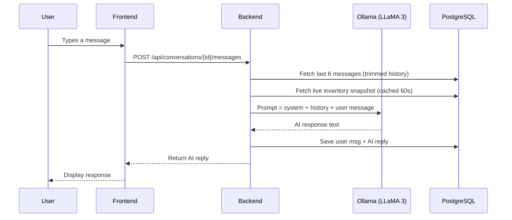
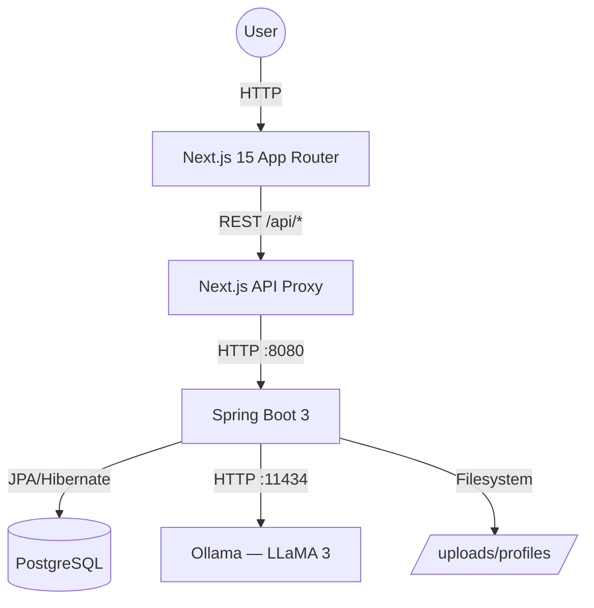

<div align="center">
  
  <h1>IMN — Inventory Management System</h1>
  <p><b>A professional-grade, AI-powered full-stack solution for modern business logistics.</b></p>

[](https://nextjs.org/)
[](https://spring.io/projects/spring-boot)
[](https://www.postgresql.org/)
[](https://www.typescriptlang.org/)
[](https://ollama.com/)

<p>
  <a href="#-overview">Overview</a> •
  <a href="#-tech-stack">Tech Stack</a> •
  <a href="#-key-features">Features</a> •
  <a href="#-emexa-ai-assistant">Emexa AI</a> •
  <a href="#-system-architecture">Architecture</a> •
  <a href="#-getting-started">Getting Started</a>
</p>
</div>

---

## 🧠 Overview

**IMN** is a full-stack inventory management platform built for professional business operations. It combines a high-performance **Spring Boot** REST API with a modern **Next.js** frontend, and is enhanced with an **on-premise AI assistant (Emexa)** powered by Ollama + LLaMA 3 — running entirely on your local machine with no external API costs.

- **Automate** tracking of SKUs, sales, and stock movements.
- **Chat with your inventory** using Emexa, an AI assistant that knows your live stock data.
- **Manage users** with role-based access control (Admin / Manager).
- **Visualize** performance through real-time dashboards, charts, and reports.
- **Audit everything** with a full activity log system.

---

## 🚀 Tech Stack

<div align="center">

[](https://skillicons.dev)

| Layer | Technologies |
|---|---|
| **Frontend** | Next.js 15 (App Router), TypeScript, Tailwind CSS, Framer Motion, Chart.js, shadcn/ui |
| **Backend** | Java 17+, Spring Boot 3.4, Spring Security, JPA / Hibernate, Spring AI |
| **AI Engine** | Ollama (local LLM runner), LLaMA 3 model, Spring AI Ollama Starter |
| **Database** | PostgreSQL 14+ |
| **Tools** | Maven, Bun, Postman, Git, Docker |

</div>

---

## ✨ Key Features

<details open>
<summary><b>📊 Enterprise Dashboard</b></summary>

Real-time operational overview with high-level KPIs:

- **Stat Cards:** Total products, total revenue, inventory value, and critical stock alerts.
- **Inventory & Profit Trend Chart:** Monthly line chart with dual series (inventory value + expected profit).
- **Most Active Day Chart:** Bar chart showing sales activity by weekday.
- **Top Sellers Table:** Ranked product table with image, units sold, and revenue.
- **Repeat Customer Gauge:** Visual gauge displaying customer retention rate.
- **Floating Action Button (FAB):** Quick-access popup for "Add Product" and "New Sale" actions.
- **Shimmer Skeleton Loading:** Smooth animated skeleton screens while data loads.

</details>

<details>
<summary><b>📦 Product & Stock Management</b></summary>

Full-lifecycle management of your inventory catalog:

- **CRUD Operations:** Create, read, update, and soft-delete products with image upload support.
- **Category Filtering:** Filter products by category, stock status, brand, and active state.
- **Stock Movement Tracking:** Granular logs for every "Stock IN" and "Stock OUT" event.
- **Real-time Deductions:** Inventory automatically adjusts upon sale confirmation.
- **Low Stock Alerts:** Visual indicators and dashboard alerts when stock falls below minimum level.
- **Pagination & Search:** Server-side pagination and full-text search across the catalog.
- **Bulk Delete:** Select and delete multiple products at once.
- **Product Images:** Upload and display product photos stored on the backend filesystem.

</details>

<details>
<summary><b>🛒 Sales Management</b></summary>

End-to-end sales processing and order tracking:

- **Multi-item Sales:** Process sales with multiple products and quantities in one transaction.
- **Automatic Stock Deduction:** Stock levels update instantly on sale confirmation.
- **Sales History:** Paginated, searchable list of all past transactions.
- **Status Filtering:** Filter sales by status (Completed, Pending, etc.) and date range.
- **Revenue Analytics:** Total revenue, order count, and top product rankings fed into the dashboard.

</details>

<details>
<summary><b>🗂️ Categories</b></summary>

Organize your product catalog with a clean category system:

- **Create & Manage Categories:** Full CRUD for product categories.
- **Product Count:** Each category displays how many products are assigned.
- **Linked Filtering:** Products page filters directly by category.

</details>

<details>
<summary><b>📝 Reports</b></summary>

Generate and store business intelligence reports:

- **Report Types:** Income, Expense, Forecast, Budget vs Actual.
- **Rich Metadata:** Each report stores name, summary, type, date range, formats (PDF/Excel), status, generated-by, total revenue, and transaction count.
- **Line Items Storage:** JSON-serialized line items stored and re-hydrated automatically.
- **Search & Filter:** Full-text search across saved reports.
- **Delete Reports:** Remove outdated reports from the system.

</details>

<details>
<summary><b>🔐 Authentication & Role-Based Access Control (RBAC)</b></summary>

Secure multi-user system with distinct permission tiers:

- **Roles:** `ADMIN` and `MANAGER` roles with scoped access.
- **Registration:** Multipart form registration with optional profile photo upload.
- **Login:** Email + password authentication returning full user context (id, name, role, email, imageUrl).
- **Session Management:** Auth state stored in `sessionStorage`; every API request sends `X-Current-User-Id` for server-side identity resolution.
- **Self-deletion Guard:** Users cannot delete their own account.
- **Profile Updates:** Users can update their username and avatar at any time.
- **Last Seen Tracking:** Login timestamps update `lastSeen` for online status detection.

</details>

<details>
<summary><b>👥 User Management (Admin)</b></summary>

Admin-only interface for managing system users:

- **User List:** View all registered users with roles, avatars, and online status.
- **Delete Users:** Remove users from the system (with self-deletion protection).
- **Online Indicator:** Users active within the last 5 minutes shown as online.
- **Profile Image Serving:** Avatars served directly from the backend `/uploads/profiles/` directory.

</details>

<details>
<summary><b>📋 Activity Logs</b></summary>

Full audit trail for all system operations:

- **Automatic Logging:** Key actions (product changes, sales, user events) are recorded automatically.
- **Who Did What:** Each log entry captures the actor, action type, entity affected, and timestamp.
- **Searchable History:** Browse and filter logs by type or keyword.

</details>

<details>
<summary><b>⚙️ Settings & Profile</b></summary>

User-facing settings and account management:

- **Profile Editing:** Update display name and upload a new avatar photo.
- **Dark / Light Mode:** Theme toggle persisted across sessions via `next-themes`.
- **Help Center:** Built-in help page for user guidance.

</details>

---

## 🤖 Emexa AI Assistant

Emexa is an on-premise conversational AI built directly into the platform, powered by **Ollama + LLaMA 3** running locally.

### How It Works



### Emexa Features

| Feature | Detail |
|---|---|
| **Per-user chat history** | Each user sees only their own conversations (isolated by `userId`) |
| **Persistent conversations** | Full message history stored in PostgreSQL and reloadable |
| **Auto-titling** | Conversation title is set automatically from the first user message |
| **Live inventory context** | Emexa always knows your current stock, low-stock items, and product counts |
| **Context caching** | Inventory data is cached for 60 seconds — no DB hit per message |
| **Trimmed history** | Only the last 6 messages are sent to the model to keep prompts fast |
| **Delete conversations** | Users can delete any conversation; it is fully removed from the DB |
| **Suggestion chips** | Pre-built query suggestions shown on empty state |
| **Sliding sidebar** | Conversation history panel slides in from the right with smooth animations |
| **Typing indicator** | Animated bounce dots while Emexa is generating a response |

### Ollama Performance Tuning

```properties
spring.ai.ollama.chat.options.temperature=0.3      # Focused, deterministic responses
spring.ai.ollama.chat.options.num-predict=512      # Cap response length for speed
spring.ai.ollama.chat.options.num-ctx=2048         # Smaller context window = faster
spring.ai.ollama.chat.options.top-k=20
spring.ai.ollama.chat.options.top-p=0.8
spring.ai.ollama.chat.options.repeat-penalty=1.1
```

---

## 🛡️ Security Architecture

- **Header-based identity:** Every frontend request sends `X-Current-User-Id`, which the backend uses to scope data (conversations, profile updates, deletes) to the correct user.
- **CORS:** Strictly configured to allow only `http://localhost:3000` and `http://localhost:5173`.
- **Password storage:** Stored as plain-text in the current implementation (upgrade to BCrypt recommended for production).
- **Self-protection guard:** Backend rejects requests where a user attempts to delete their own account.
- **Profile ownership:** Only the owning user can update their own profile (enforced server-side).

---

## 🏗️ System Architecture



---

## 🖼️ Schema Overview

.png)

---

## 📁 Project Structure

```
📁 inventory-system/
│
├── backend/                        # Spring Boot REST API
│   └── src/main/java/com/imane/inventorysystem/
│       ├── controller/             # REST endpoints
│       │   ├── AuthController      # Login, register, user management
│       │   ├── ChatController      # Emexa conversation & message endpoints
│       │   ├── ProductController   # Product CRUD + toggle active
│       │   ├── CategoryController  # Category CRUD
│       │   ├── SaleController      # Sales processing
│       │   ├── ReportController    # Report CRUD
│       │   └── ActivityLogController
│       ├── service/
│       │   └── ChatService         # AI prompt assembly, inventory cache, Ollama calls
│       ├── entity/                 # JPA entities
│       │   ├── User, Role
│       │   ├── Product, Category
│       │   ├── Sale, SaleItem
│       │   ├── Conversation, ChatMessage
│       │   ├── Report
│       │   ├── ActivityLog
│       │   └── StockMovement
│       ├── repository/             # Spring Data JPA repositories
│       ├── dto/                    # Request / response DTOs
│       └── config/                 # Security, CORS, interceptors
│
├── frontend/                       # Next.js 15 App
│   └── src/
│       ├── app/
│       │   ├── dashboard/          # Main app pages
│       │   │   ├── page.tsx        # Dashboard overview
│       │   │   ├── EmexaAssistant/ # AI chat interface
│       │   │   ├── products/       # Product management
│       │   │   ├── categories/     # Category management
│       │   │   ├── sales/          # Sales management
│       │   │   ├── reports/        # Reports
│       │   │   ├── users/          # Admin user management
│       │   │   ├── activity-logs/  # Audit log viewer
│       │   │   ├── settings/       # User settings & profile
│       │   │   └── help/           # Help center
│       │   ├── login/              # Login page
│       │   └── register/           # Registration page
│       ├── components/
│       │   ├── dashboard/          # DashboardHeader, SidebarApp, Charts, StatCard
│       │   ├── AiAssistant.tsx     # Emexa info/documentation card
│       │   └── ui/                 # shadcn/ui components
│       ├── lib/
│       │   └── api.ts              # All API calls with auth headers
│       └── types/                  # TypeScript interfaces
│
└── README.md
```

---

## ⚙️ Getting Started

### 📋 Prerequisites

| Requirement | Version |
|---|---|
| Java | 17+ |
| Node.js / Bun | 18+ / latest |
| PostgreSQL | 14+ |
| Ollama | latest |

### 🔧 1 — Install Ollama & Pull the Model

```bash
# Install Ollama from https://ollama.com
ollama pull llama3
ollama serve          # Runs on http://localhost:11434
```

### 🗄️ 2 — Set Up the Database

Create a PostgreSQL database named `inventory-system` and configure your credentials:

```properties
# backend/src/main/resources/application.properties
spring.datasource.url=jdbc:postgresql://localhost:5432/inventory-system
spring.datasource.username=YOUR_USERNAME
spring.datasource.password=YOUR_PASSWORD
```

### 🚀 3 — Launch the Backend

```bash
cd backend
./mvnw spring-boot:run
# API available at http://localhost:8080
```

### 💻 4 — Launch the Frontend

```bash
cd frontend
bun install
bun dev
# App available at http://localhost:3000
```

### 🐳 Docker (Optional)

```bash
docker-compose up --build
```

---

## 🔌 API Reference

| Method | Endpoint | Description |
|---|---|---|
| `POST` | `/api/auth/register` | Register a new user (multipart) |
| `POST` | `/api/auth/login` | Login and get user session data |
| `GET` | `/api/auth/users` | List all users (admin) |
| `DELETE` | `/api/auth/users/{id}` | Delete a user |
| `PATCH` | `/api/auth/users/{id}/profile` | Update username / avatar |
| `GET` | `/api/v1/products` | List products (search, filter, paginate) |
| `POST` | `/api/v1/products` | Create a product |
| `PUT` | `/api/v1/products/{id}` | Update a product |
| `DELETE` | `/api/v1/products/{id}` | Delete a product |
| `PATCH` | `/api/v1/products/{id}/toggle-active` | Toggle product active state |
| `GET` | `/api/v1/categories` | List all categories |
| `POST` | `/api/v1/sales/process` | Process a new sale |
| `GET` | `/api/v1/sales` | List sales (filter, paginate) |
| `GET` | `/api/reports` | List reports |
| `POST` | `/api/reports` | Save a report |
| `DELETE` | `/api/reports/{id}` | Delete a report |
| `GET` | `/api/conversations` | Get user's conversations |
| `POST` | `/api/conversations` | Create a new conversation |
| `GET` | `/api/conversations/{id}` | Get messages in a conversation |
| `POST` | `/api/conversations/{id}/messages` | Send a message to Emexa |
| `DELETE` | `/api/conversations/{id}` | Delete a conversation |

> All endpoints that modify or read user-scoped data accept `X-Current-User-Id` header for identity resolution.

---

## 📄 License

This project is licensed under the MIT License — see the [LICENSE](LICENSE) file for details.

---

## 📬 Contact & Links

<div align="center">

[](https://www.linkedin.com/in/imaneellaouzi/)
[](https://imane-ellaouzi.vercel.app/)
[](mailto:emanellaouzi.05@gmail.com)

**Built with ❤️ by Imane Ellaouzi**
</div>
