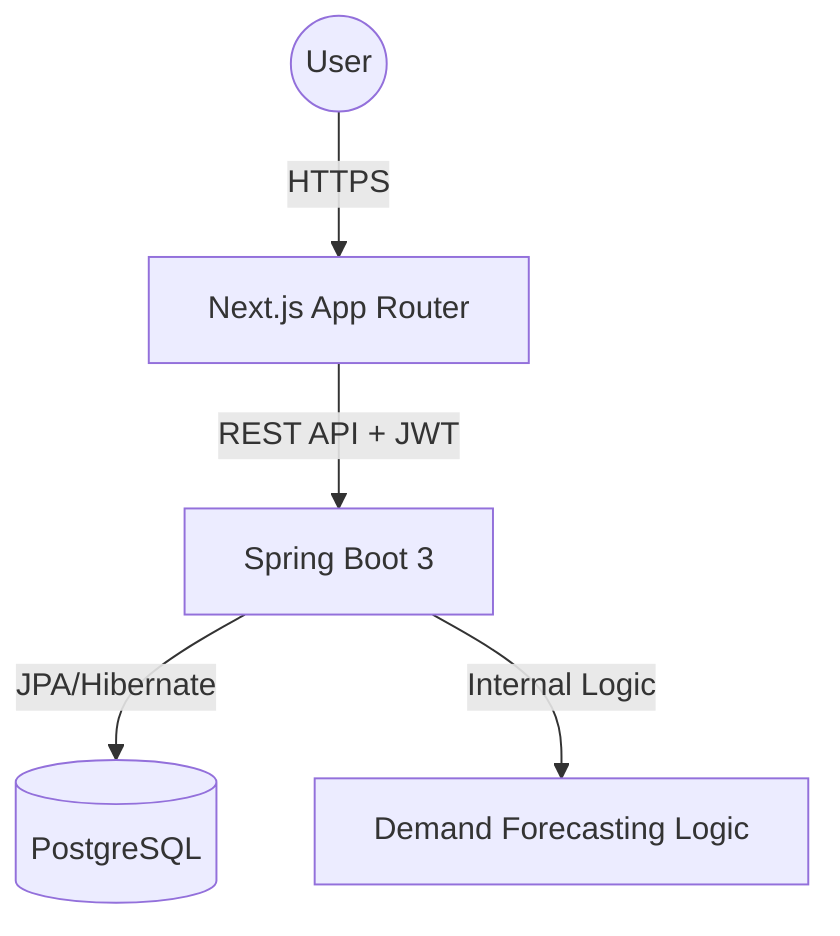

<div align="center">
  
  <h1> Inventory Management System</h1>
  <p><b>A professional-grade, AI-powered full-stack solution for modern business logistics.</b></p>

[](https://nextjs.org/)
[](https://spring.io/projects/spring-boot)
[](https://www.postgresql.org/)
[](https://www.typescriptlang.org/)
<p>
  <a href="#-key-features">Features</a> •
  <a href="#-tech-stack">Tech Stack</a> •
  <a href="#-system-architecture">Architecture</a> •
  <a href="#-getting-started">Getting Started</a>
</p>
</div>

---

## 🧠 Overview

In modern commerce, data is the difference between profit and loss. This **Inventory Management System** is engineered to bridge that gap. Built with a robust **Spring Boot** micro-service architecture and a high-performance **Next.js** frontend, it transforms raw inventory data into actionable AI-powered insights.

- **Automate** tracking of thousands of SKUs across multiple categories.
- **Optimize** stock levels with intelligent restocking suggestions.
- **Secure** sensitive business data with enterprise-grade JWT authentication.
- **Visualize** sales performance through real-time dynamic dashboards.

---

## 🚀 Tech Stack

### 💻 Core Infrastructure

<div align="center">

[](https://skillicons.dev)

| Layer | Technologies |
|---|---|
| **Frontend** | Next.js (App Router), TypeScript, Tailwind CSS, Framer Motion, Chart.js |
| **Backend** | Java 17+, Spring Boot 3, Spring Security, JPA/Hibernate |
| **Database** | PostgreSQL (Relational persistence) |
| **Tools** | Maven, Bun, Postman, Git |

</div>

---

## ✨ Key Features

<details open>
<summary><b>📊 Enterprise Dashboard</b></summary>

Real-time operational overview with high-level metrics:

- **Total Analytics:** Instant visibility into products, sales, and net profit.
- **Dynamic Visuals:** Interactive charts using Chart.js for trend analysis.
- **Critical Alerts:** Automated low-stock detection to prevent inventory gaps.
- **Smart Insights:** AI-driven panel for inventory optimization.

</details>

<details>
<summary><b>📦 Advanced Product & Stock Control</b></summary>

Full-lifecycle management of inventory:

- **Full CRUD Operations:** Specialized management of product catalogs.
- **Movement Tracking:** Granular logs for every "Stock IN" and "Stock OUT" event.
- **Real-time Deductions:** Automatic inventory adjustments upon sale confirmation.

</details>

<details>
<summary><b>🔐 Security & Access Control (RBAC)</b></summary>

Implemented a multi-tier authorization system using **Spring Security** and **JWT**:

- **Admin:** Full system control, user management, and sensitive report access.
- **Manager:** Operational access limited to daily stock and sales management.
- **Stateless Auth:** Secure token-based authentication for scalable performance.

</details>

<details>
<summary><b>🤖 AI-Powered Intelligence</b></summary>

Leveraging predictive logic to assist in decision making:

- **Restock Forecasting:** Identifies high-velocity items nearing depletion.
- **Performance Analysis:** Flags underperforming products to optimize shelf space.

</details>

---

## 🛡️ Technical Deep Dive

### 🔑 Security Architecture
The application employs a stateless **JWT (JSON Web Token)** authentication strategy.
- **Password Hashing:** BCrypt for secure credential storage.
- **CORS Configuration:** Strictly defined origins for frontend communication.
- **Granular Permissions:** Method-level security annotations in the Spring backend.

### 🏗️ System Architecture


---

## 🗄️ Database Schema

### `users` Table

| Field | Type | Description |
|---|---|---|
| id | INT (PK) | Primary key |
| username | VARCHAR | Username |
| email | VARCHAR | example.gmail.com |
| password | VARCHAR | Hashed password |
| role | ENUM | `ADMIN` / `MANAGER` |

## 🖼️ Schema Overview

.png)

---

## 🏗️ Project Architecture

```
📁 inventory-system/
│
├── 🟢 backend/          # Java Spring Boot REST API
├── 🟣 frontend/         # Next.js 15+ Frontend
└── 📄 README.md         # Documentation
```

### 📁 Technical Blueprint

<details>
<summary><b>Backend Structure (Spring Boot)</b></summary>

```
backend/
├── src/main/java/com/inventory/
│   ├── controller/        # RESTful API Endpoints
│   ├── service/           # Business Logic Layer
│   ├── repository/        # Data Access Layer (JPA)
│   ├── model/             # Database Entities
│   ├── dto/               # Type-safe Data Transfer
│   └── config/            # Security & Bean Configs
└── pom.xml                # Dependency Management
```
</details>

<details>
<summary><b>Frontend Structure (Next.js)</b></summary>

```
frontend/
├── app/                   # Next.js App Router (Pages & Layouts)
├── components/            # Atomic UI & Section Components
├── services/              # API Communication (Axios/Fetch)
├── hooks/                 # Custom React Logic
└── types/                 # TypeScript Interfaces
```
</details>

---

## ⚙️ Getting Started

### 📋 Prerequisites
- **Java:** 17+
- **Node.js:** 18+ (Bun recommended)
- **Database:** PostgreSQL 14+

### 🚀 Quick Start

1. **Clone & Navigate**
   ```bash
   git clone https://github.com/ImaneElla/inventory-system.git
   cd inventory-system
   ```

2. **Initialize Database**
   Create a database named `inventory_db` in PostgreSQL and update `backend/src/main/resources/application.properties` with your credentials.

3. **Launch Backend**
   ```bash
   cd backend
   mvn spring-boot:run
   ```

4. **Launch Frontend**
   ```bash
   cd frontend
   bun install && bun dev
   ```

---

## 📬 Contact & Links

<div align="center">

[](https://www.linkedin.com/in/imaneellaouzi/)
[](https://imane-ellaouzi.vercel.app/)
[](mailto:emanellaouzi.05@gmail.com)

**Built with ❤️ for professional efficiency.**
</div>
